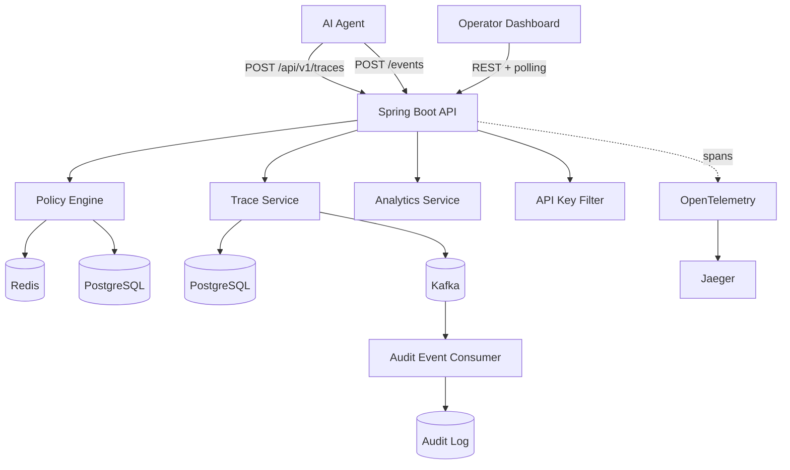

# AgentLens

Observe, govern, and audit every AI agent action in real time.

AgentLens is an AI agent observability and governance platform built with Spring Boot. It records agent traces, enforces governance policies during execution, persists immutable audit records, streams operational events through Kafka, exports traces to Jaeger, and exposes a React operator dashboard for approvals and analytics.

## What Ships Now

- Trace ingestion APIs with event-level governance, timeline views, and completion metrics.
- Policy engine with `RATE_LIMIT`, `TOKEN_BUDGET`, `COST_BUDGET`, `TOOL_BLOCK`, `PII_CHECK`, and `REQUIRE_APPROVAL`.
- Human approval workflow with `PENDING_APPROVAL`, operator approve/reject actions, and resumed or blocked traces.
- API-key security using `X-API-Key` with separate `INGEST` and `OPERATOR` scopes.
- Kafka-backed audit/event publishing with persisted audit log consumption.
- Analytics APIs for summary, spend, latency, top agents, and violation trends.
- OpenTelemetry starter integration with OTLP export to Jaeger plus Micrometer counters.
- React dashboard under [`dashboard/`](./dashboard) with Traces, Trace Detail, Policies, Violations, and Analytics pages.
- Automated backend and frontend tests, including Testcontainers-backed integration coverage when Docker is available.

## Architecture



More detail is in [`docs/architecture.md`](./docs/architecture.md).

## Quick Start

### 1. Start infrastructure

```bash
docker compose up -d
```

Services exposed locally:

- PostgreSQL: `localhost:5432`
- Redis: `localhost:6379`
- Kafka: `localhost:9092`
- Jaeger: [http://localhost:16686](http://localhost:16686)

### 2. Start the backend

```bash
SPRING_PROFILES_ACTIVE=local ./mvnw spring-boot:run
```

The `local` profile enables:

- demo agents and synthetic trace generation
- localhost CORS for the dashboard
- local API keys:
  - `ingest-local-key`
  - `operator-local-key`

Without `SPRING_PROFILES_ACTIVE=local` or `dev`, demo traffic does not run.

### 3. Start the dashboard

```bash
cd dashboard
npm install
npm run dev
```

Open:

- Dashboard UI: [http://localhost:5173](http://localhost:5173)
- Backend API landing: [http://localhost:8080](http://localhost:8080)
- Health endpoint: [http://localhost:8080/actuator/health](http://localhost:8080/actuator/health)

Important:

- `http://localhost:5173` is the browser-facing operator UI.
- `http://localhost:8080` is the backend API server, not a separate web app.
- `/actuator/health` is public.
- All `/api/v1/*` routes require `X-API-Key`.

Default dashboard expectations:

- API base URL: `http://localhost:8080`
- Operator key: `operator-local-key`

Override them with [`dashboard/.env.example`](./dashboard/.env.example).

## Core Flows

### Trace lifecycle

1. `POST /api/v1/traces` starts a run and executes pre-execution policies such as rate limits.
2. `POST /api/v1/traces/{id}/events` appends tool/retrieval/guardrail events and immediately evaluates event-ingest policies.
3. `PUT /api/v1/traces/{id}/complete` finalizes the run, calculates cost, and evaluates completion policies.

### Approval workflow

1. A `REQUIRE_APPROVAL` policy matches a risky tool event.
2. The trace moves to `PENDING_APPROVAL`.
3. A violation is persisted with `actionTaken=PENDING_APPROVAL`.
4. Operators approve via `POST /api/v1/violations/{id}/approve` or reject via `POST /api/v1/violations/{id}/reject`.
5. Approved traces return to `RUNNING`; rejected traces become `BLOCKED`.

## Screenshots

### Dashboard overview


### Trace detail timeline


### Pending approval queue


### Analytics overview


### Jaeger trace view


## Key Endpoints

| Method | Path | Purpose |
| --- | --- | --- |
| `GET` | `/` | Public API landing metadata |
| `POST` | `/api/v1/traces` | Start trace |
| `POST` | `/api/v1/traces/{id}/events` | Add event with event-stage policy enforcement |
| `PUT` | `/api/v1/traces/{id}/complete` | Complete trace |
| `GET` | `/api/v1/traces/{id}/timeline` | Timeline view for dashboard |
| `POST` | `/api/v1/policies/evaluate` | Dry-run policy evaluation |
| `POST` | `/api/v1/violations/{id}/approve` | Approve pending trace |
| `POST` | `/api/v1/violations/{id}/reject` | Reject pending trace |
| `GET` | `/api/v1/analytics/*` | Summary, cost, latency, trends, top agents |

See [`docs/api-examples.http`](./docs/api-examples.http) for a full local walkthrough with copy/paste requests.

## Testing

Backend:

```bash
./mvnw test
```

- Unit tests always run.
- The Testcontainers integration test is skipped automatically when Docker is unavailable.

Frontend:

```bash
cd dashboard
npm test
npm run build
```

## Tech Stack

| Layer | Technology |
| --- | --- |
| Backend | Java 21, Spring Boot 3.4 |
| Storage | PostgreSQL 16 |
| Streaming | Kafka |
| Rate limiting | Redis |
| Migrations | Flyway |
| Metrics | Micrometer + Prometheus |
| Tracing | OpenTelemetry starter + Jaeger |
| Frontend | Vite, React, TypeScript, TanStack Query, Recharts, Tailwind |
| Tests | JUnit 5, Mockito, Testcontainers, Vitest |

## Project Structure

```text
AgentLens/
├── dashboard/                  # React operator UI
├── docker-compose.yml
├── docs/
│   ├── api-examples.http
│   ├── architecture.md
│   └── screenshots/
├── src/main/java/dev/ayush/agentlens/
│   ├── agent/
│   ├── analytics/
│   ├── audit/
│   ├── common/
│   ├── config/
│   ├── demo/
│   ├── kafka/
│   ├── policy/
│   └── trace/
└── src/test/java/dev/ayush/agentlens/
```
