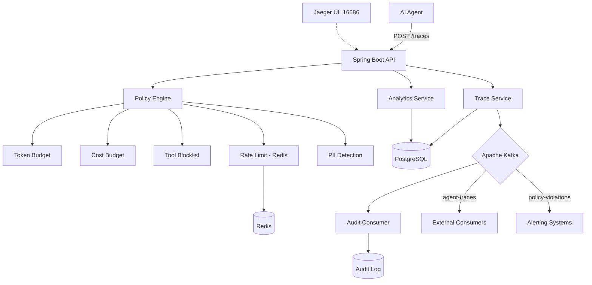

# AgentLens

Observe, govern, and audit every AI agent action in real time

AgentLens is a backend platform built in Java/Spring Boot that captures full execution traces from AI agents (LLM calls, tool invocations, document retrievals), enforces governance policies in real time (token budgets, cost limits, tool blocklists, PII detection, rate limiting), and streams all events through Kafka to an immutable audit log. Think of it as Datadog + Open Policy Agent for AI agent workflows.

## Architecture



## Tech Stack

| Component | Technology |
|-----------|-----------|
| Language | Java 21 |
| Framework | Spring Boot 3.4 |
| Database | PostgreSQL 16 |
| Cache / Rate Limiting | Redis 7 |
| Event Streaming | Apache Kafka |
| Schema Migrations | Flyway |
| Observability | Jaeger runtime via Docker Compose, OpenTelemetry planned |
| Metrics | Micrometer, Prometheus |
| Containerization | Docker Compose |

## Features

- Full trace capture: prompts, tool calls, retrievals, latency, tokens, and estimated cost are persisted per run.
- Pluggable policy engine: token budget, cost budget, tool blocklist, rate limit, and PII detection evaluators are registered as separate Spring beans.
- Real-time governance: policies can emit `BLOCK`, `WARN`, or `LOG` outcomes and are enforced during trace execution.
- Redis-backed rate limiting: per-agent counters use atomic Redis operations with TTL-based windows.
- PII detection: prompts and responses are scanned for email, phone, SSN, and credit card patterns.
- Kafka event streaming: trace completions, policy violations, and audit events are published to separate topics.
- Immutable audit log: all significant actions are persisted as append-only audit entries for traceability.
- Analytics APIs: summary metrics, cost breakdowns, latency percentiles, violation trends, and top-agent rankings are available over REST.
- Demo data generator: four simulated agents continuously generate realistic trace traffic for local testing.
- Cost tracking across multiple LLM providers: built-in pricing supports GPT-4, GPT-4o, Claude Sonnet, and Claude Haiku models.

## Quick Start

```bash
# Prerequisites: Java 21, Maven, Docker

# Clone and start
git clone https://github.com/ayushanandhere/AgentLens.git
cd AgentLens
docker-compose up -d        # Start Postgres, Redis, Kafka, Jaeger
./mvnw spring-boot:run      # Start AgentLens (demo data auto-generates)

# Verify
curl http://localhost:8080/api/v1/analytics/summary | python3 -m json.tool
```

Jaeger is exposed at `http://localhost:16686`. The current backend provisions Jaeger in Docker Compose; full OpenTelemetry export is a planned follow-up.

## API Reference

### Agent Management

| Method | Endpoint | Description |
|--------|----------|-------------|
| POST | `/api/v1/agents` | Register agent |
| GET | `/api/v1/agents` | List agents |
| GET | `/api/v1/agents/{id}` | Agent details |
| PATCH | `/api/v1/agents/{id}` | Update agent |
| POST | `/api/v1/agents/{id}/kill` | Kill switch |

### Trace Ingestion

| Method | Endpoint | Description |
|--------|----------|-------------|
| POST | `/api/v1/traces` | Start trace |
| POST | `/api/v1/traces/{id}/events` | Add event |
| PUT | `/api/v1/traces/{id}/complete` | Complete trace |
| GET | `/api/v1/traces` | List traces (filtered) |
| GET | `/api/v1/traces/{id}` | Trace detail + events |

### Policy Management

| Method | Endpoint | Description |
|--------|----------|-------------|
| POST | `/api/v1/policies` | Create policy |
| GET | `/api/v1/policies` | List policies |
| PUT | `/api/v1/policies/{id}` | Update policy |
| DELETE | `/api/v1/policies/{id}` | Disable policy |

### Governance

| Method | Endpoint | Description |
|--------|----------|-------------|
| GET | `/api/v1/violations` | List violations |
| POST | `/api/v1/violations/{id}/approve` | Override violation |

### Analytics

| Method | Endpoint | Description |
|--------|----------|-------------|
| GET | `/api/v1/analytics/summary` | Summary stats |
| GET | `/api/v1/analytics/cost` | Cost breakdown |
| GET | `/api/v1/analytics/latency` | Latency percentiles |
| GET | `/api/v1/analytics/violations` | Violation trends |
| GET | `/api/v1/analytics/top-agents` | Top agents |

### Audit

| Method | Endpoint | Description |
|--------|----------|-------------|
| GET | `/api/v1/audit` | Query audit log |

## Design Decisions

1. **Why Kafka for audit**

   Kafka's log retention enables replay capability. If the audit consumer crashes, no events are lost because they remain in the topic and are replayed on restart. This matters for compliance and incident investigation. A direct database write on the hot path would be simpler, but it would couple ingestion to persistence and increase the chance of dropped events during failures.

2. **Pluggable policy engine**

   Each policy type is implemented as a separate Spring bean behind a common `PolicyEvaluator` interface. Adding a new policy requires one new evaluator class and one enum registration, without modifying existing evaluator logic. That keeps the engine open for extension and closed for modification.

3. **Redis for rate limiting**

   Rate limiting requires atomic increment plus TTL in a distributed system. Redis `INCR` and `EXPIRE` provide that in constant time and work across multiple application instances. In-memory counters would reset on restart and would not coordinate across nodes.

4. **Synchronous BLOCK vs async WARN**

   `BLOCK`-severity policies are evaluated synchronously on the trace path because they must prevent unsafe actions before the trace can proceed. `WARN` policies could be evaluated asynchronously in a later version to shave hot-path latency, but the current backend keeps the control flow simple by running all evaluators synchronously.

5. **Immutable audit log**

   The `audit_log` table is treated as append-only. The API exposes querying but not mutation, and the consumer only inserts new rows. This is deliberate: compliance trails should be tamper-evident and replayable.

6. **Cost calculation with BigDecimal**

   LLM pricing involves very small per-token values. Using floating-point arithmetic would introduce rounding drift over time, especially under heavy load. `BigDecimal` keeps per-trace and aggregate cost values stable and exact.

## Project Structure

```text
agentlens/
├── docker-compose.yml
├── pom.xml
├── src/main/java/dev/ayush/agentlens/
│   ├── AgentLensApplication.java
│   ├── agent/              # Agent CRUD + DTOs
│   ├── trace/              # Trace ingestion + querying
│   ├── policy/             # Policy CRUD + violations
│   │   └── engine/         # Policy evaluation framework
│   │       └── evaluators/ # 5 evaluator implementations
│   ├── analytics/          # Aggregation queries + DTOs
│   ├── audit/              # Audit log querying
│   ├── kafka/              # Producers + consumer
│   │   └── event/          # Event DTOs
│   ├── demo/               # Simulated agent data generator
│   ├── config/             # Kafka config
│   └── common/             # Exceptions, utilities
└── src/main/resources/
    ├── application.yml
    └── db/migration/       # V1-V8 Flyway migrations
```

## Example Verification

```bash
curl -s http://localhost:8080/api/v1/analytics/summary | python3 -m json.tool
curl -s "http://localhost:8080/api/v1/analytics/cost?groupBy=model" | python3 -m json.tool
curl -s "http://localhost:8080/api/v1/analytics/top-agents?limit=5" | python3 -m json.tool
curl -s "http://localhost:8080/api/v1/traces?size=5&sort=startedAt,desc" | python3 -m json.tool
curl -s "http://localhost:8080/api/v1/audit?size=5" | python3 -m json.tool
```

## Future Enhancements (V2)

- MCP tool compatibility: expose AgentLens as an MCP server for assistants and external tools.
- React dashboard with real-time WebSocket updates.
- Anomaly detection using Spring AI.
- Multi-tenancy with isolated API keys and policy budgets.
- Trace replay against new policies before rollout.
- OpenTelemetry export to Jaeger for platform self-observability.
- Integration test suite with Testcontainers.
