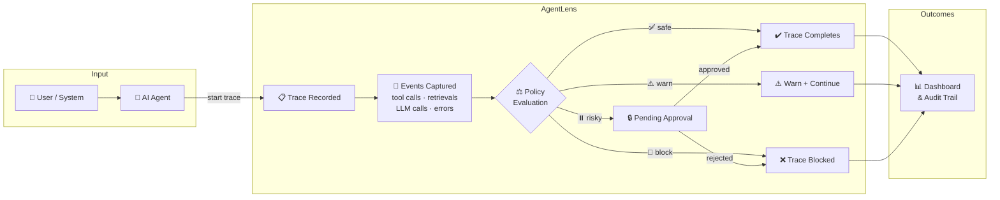
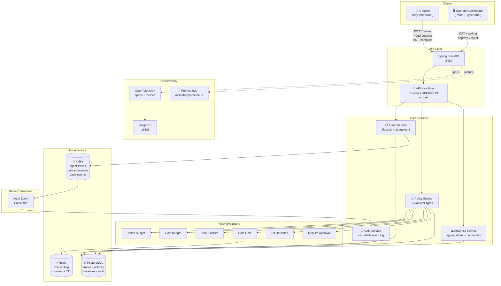
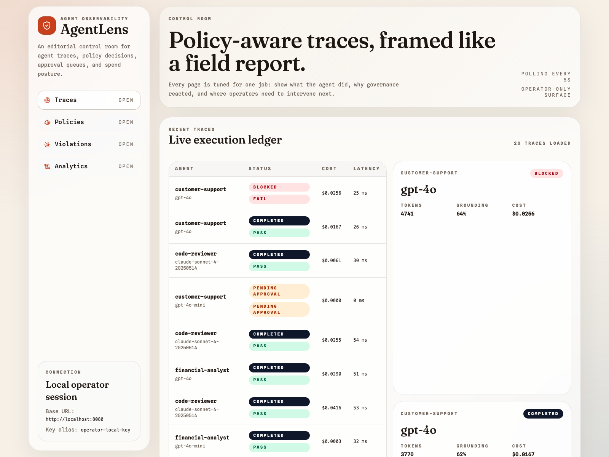
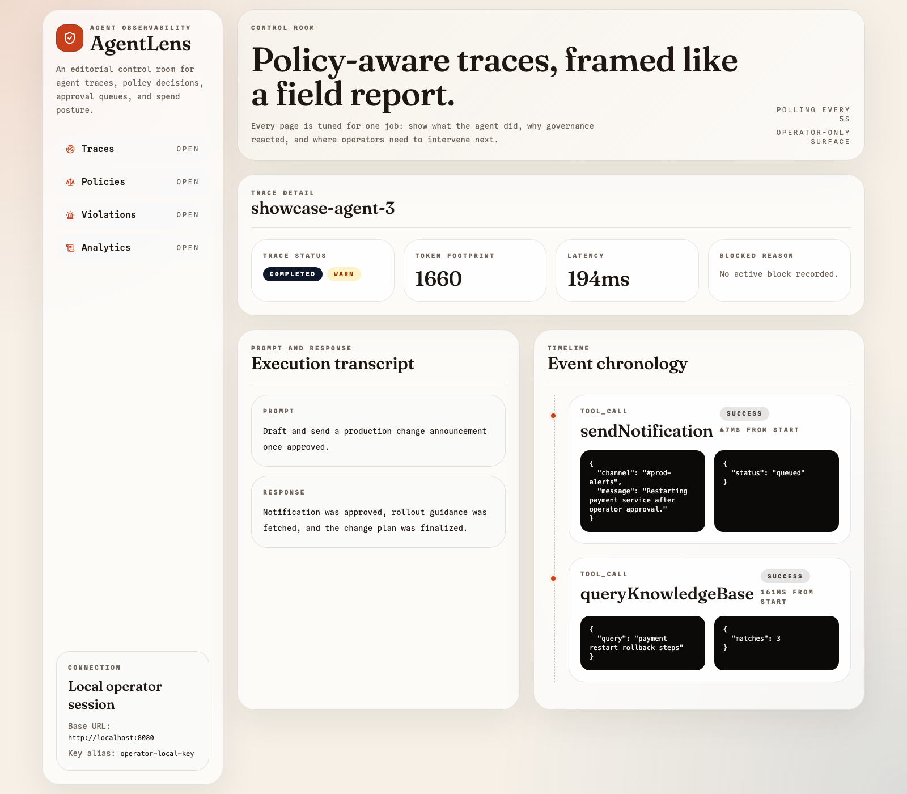
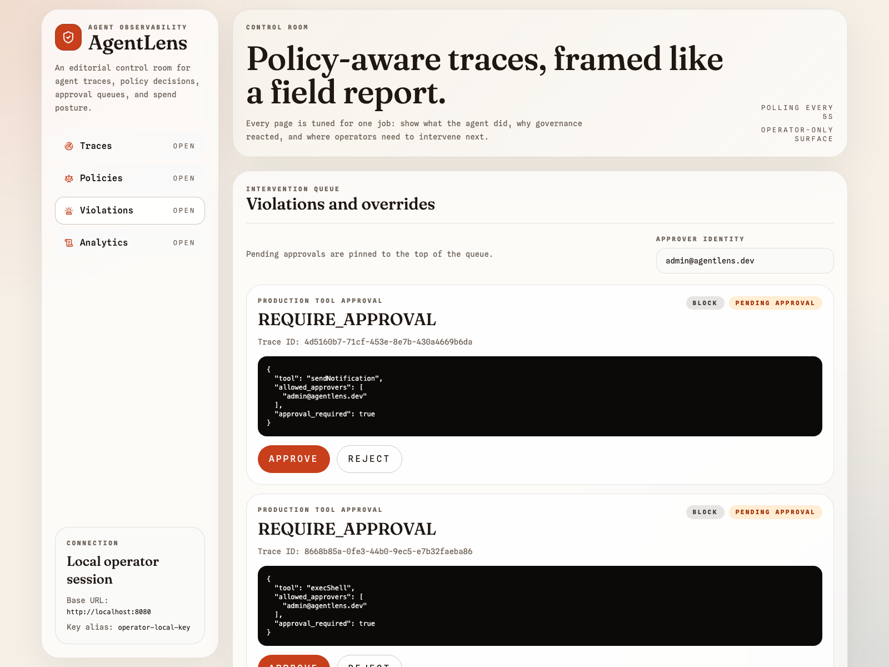
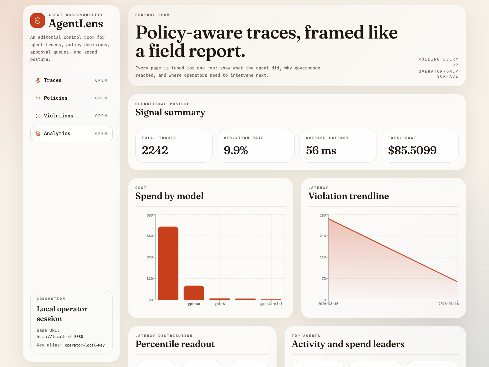
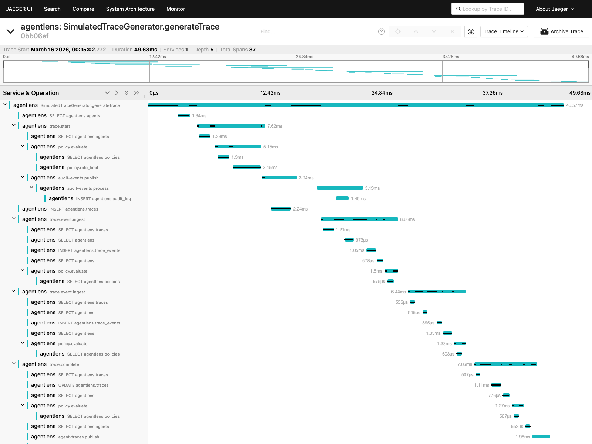

# AgentLens

Observe, govern, and audit every AI agent action in real time.

AgentLens is a platform for understanding what an AI agent did, why it did it, whether it should have been allowed to do it, and how a human operator can step in when needed.

Modern AI agents do more than generate text. They search documents, call tools, query databases, send messages, and make decisions step by step. That makes them powerful, but it also makes them harder to trust. If an agent gives a bad answer, that is one problem. If an agent triggers the wrong tool, leaks sensitive information, spends too much money, or performs an unsafe action without oversight, that is a much bigger operational problem.

AgentLens exists to solve that problem.

Instead of treating an agent run like a black box, AgentLens turns it into something visible and manageable. Every run is captured as a trace. Every important step inside that run can be recorded as an event. Policies can be evaluated while the run is happening, not only after it finishes. If a risky action appears, the platform can warn, block, or pause the trace and ask a human for approval. At the same time, the system keeps an audit trail and exposes dashboards so an operator can understand what happened without reading backend logs or guessing from scattered metrics.

## Why This Project Matters

When teams move from simple chatbot demos to real AI agents, three problems appear very quickly:

1. It becomes hard to see what the agent actually did.
2. It becomes hard to enforce safety and compliance rules consistently.
3. It becomes hard to explain incidents after something goes wrong.

AgentLens addresses all three:

- It makes agent behavior observable by recording traces, events, latency, tokens, and cost.
- It makes agent behavior governable by evaluating policies during execution.
- It makes agent behavior auditable by storing violations, actions, and operator interventions.

In other words, AgentLens sits between "an agent is running" and "an operator needs confidence that the run is safe, understandable, and accountable."

## What AgentLens Does In Simple Terms

Think of AgentLens as a control room for AI agents.

- An agent starts a task.
- AgentLens records that task as a trace.
- As the agent performs actions, AgentLens records those actions as events.
- Each event can be checked against safety or governance rules.
- If something looks risky, AgentLens can stop the run, warn the operator, or request approval.
- After the run finishes, AgentLens shows the full story in a dashboard and preserves an audit trail for later review.

That means AgentLens helps answer questions like:

- What exactly did the agent do?
- Which tool call caused a policy violation?
- Was the run blocked, approved, or completed normally?
- How much time, tokens, and cost did this run consume?
- If something went wrong, what is the evidence?

## A Beginner-Friendly Example

Imagine an AI agent helping with production operations.

1. A user asks the agent to restart a service.
2. The agent gathers context and decides to call a tool such as `sendNotification` or `execShell`.
3. AgentLens records the trace and each tool call as it happens.
4. A policy notices that one of those actions is sensitive.
5. Instead of silently letting the agent continue, AgentLens pauses the trace and creates a pending approval item.
6. An operator reviews the request in the dashboard and either approves or rejects it.
7. The final result, decision path, and audit trail remain available for later inspection.

Without a system like this, the team would usually piece the story together from application logs, database entries, and manual guesses. AgentLens brings that story into one place and makes it understandable.

## High-Level View


## In One Sentence

AgentLens helps teams run AI agents more responsibly by making each run observable, governable, and reviewable from start to finish.

## Architecture



More detail is in [`docs/architecture.md`](./docs/architecture.md).

## Quick Start

### 1. Start infrastructure

```bash
docker compose up -d
```

Services exposed locally:

- PostgreSQL: `localhost:5432`
- Redis: `localhost:6379`
- Kafka: `localhost:9092`
- Jaeger: [http://localhost:16686](http://localhost:16686)

### 2. Start the backend

```bash
SPRING_PROFILES_ACTIVE=local ./mvnw spring-boot:run
```

The `local` profile enables:

- demo agents and synthetic trace generation
- localhost CORS for the dashboard
- local API keys:
  - `ingest-local-key`
  - `operator-local-key`

Without `SPRING_PROFILES_ACTIVE=local` or `dev`, demo traffic does not run.

### 3. Start the dashboard

```bash
cd dashboard
npm install
npm run dev
```

Open:

- Dashboard UI: [http://localhost:5173](http://localhost:5173)
- Backend API landing: [http://localhost:8080](http://localhost:8080)
- Health endpoint: [http://localhost:8080/actuator/health](http://localhost:8080/actuator/health)

Important:

- `http://localhost:5173` is the browser-facing operator UI.
- `http://localhost:8080` is the backend API server, not a separate web app.
- `/actuator/health` is public.
- All `/api/v1/*` routes require `X-API-Key`.

Default dashboard expectations:

- API base URL: `http://localhost:8080`
- Operator key: `operator-local-key`

Override them with [`dashboard/.env.example`](./dashboard/.env.example).

## Core Flows

### Trace lifecycle

1. `POST /api/v1/traces` starts a run and executes pre-execution policies such as rate limits.
2. `POST /api/v1/traces/{id}/events` appends tool/retrieval/guardrail events and immediately evaluates event-ingest policies.
3. `PUT /api/v1/traces/{id}/complete` finalizes the run, calculates cost, and evaluates completion policies.

### Approval workflow

1. A `REQUIRE_APPROVAL` policy matches a risky tool event.
2. The trace moves to `PENDING_APPROVAL`.
3. A violation is persisted with `actionTaken=PENDING_APPROVAL`.
4. Operators approve via `POST /api/v1/violations/{id}/approve` or reject via `POST /api/v1/violations/{id}/reject`.
5. Approved traces return to `RUNNING`; rejected traces become `BLOCKED`.

## Screenshots

### Dashboard overview



### Trace detail timeline



### Pending approval queue



### Analytics overview



### Jaeger trace view



## Key Endpoints

| Method | Path | Purpose |
| --- | --- | --- |
| `GET` | `/` | Public API landing metadata |
| `POST` | `/api/v1/traces` | Start trace |
| `POST` | `/api/v1/traces/{id}/events` | Add event with event-stage policy enforcement |
| `PUT` | `/api/v1/traces/{id}/complete` | Complete trace |
| `GET` | `/api/v1/traces/{id}/timeline` | Timeline view for dashboard |
| `POST` | `/api/v1/policies/evaluate` | Dry-run policy evaluation |
| `POST` | `/api/v1/violations/{id}/approve` | Approve pending trace |
| `POST` | `/api/v1/violations/{id}/reject` | Reject pending trace |
| `GET` | `/api/v1/analytics/*` | Summary, cost, latency, trends, top agents |

See [`docs/api-examples.http`](./docs/api-examples.http) for a full local walkthrough with copy/paste requests.

## Testing

Backend:

```bash
./mvnw test
```

- Unit tests always run.
- The Testcontainers integration test is skipped automatically when Docker is unavailable.

Frontend:

```bash
cd dashboard
npm test
npm run build
```

## Tech Stack

| Layer | Technology |
| --- | --- |
| Backend | Java 21, Spring Boot 3.4 |
| Storage | PostgreSQL 16 |
| Streaming | Kafka |
| Rate limiting | Redis |
| Migrations | Flyway |
| Metrics | Micrometer + Prometheus |
| Tracing | OpenTelemetry starter + Jaeger |
| Frontend | Vite, React, TypeScript, TanStack Query, Recharts, Tailwind |
| Tests | JUnit 5, Mockito, Testcontainers, Vitest |

## Project Structure

```text
AgentLens/
├── dashboard/                  # React operator UI
├── docker-compose.yml
├── docs/
│   ├── api-examples.http
│   ├── architecture.md
│   └── screenshots/
├── src/main/java/dev/ayush/agentlens/
│   ├── agent/
│   ├── analytics/
│   ├── audit/
│   ├── common/
│   ├── config/
│   ├── demo/
│   ├── kafka/
│   ├── policy/
│   └── trace/
└── src/test/java/dev/ayush/agentlens/
```
